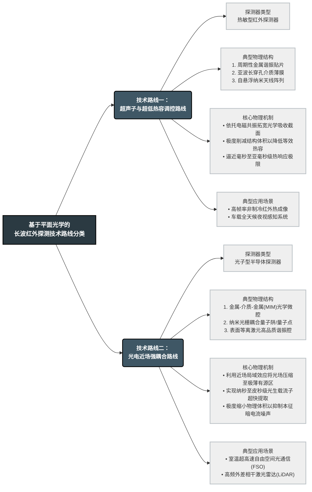

```mermaid
graph LR
    Root["基于平面光学的<br>长波红外探测技术路线分类"] 

    %% 第一条路线分支
    Route1("技术路线一：<br>超声子与超低热容调控路线")
    Root --> Route1
    
    R1_Target["探测器类型<br>热敏型红外探测器"]
    R1_Structure["典型物理结构<br>1. 周期性金属谐振贴片<br>2. 亚波长穿孔介质薄膜<br>3. 自悬浮纳米天线阵列"]
    R1_Core["核心物理机制<br>• 依托电磁共振拓宽光学吸收截面<br>• 极度削减结构体积以降低等效热容<br>• 逼近毫秒至亚毫秒级热响应极限"]
    R1_App["典型应用场景<br>• 高帧率非制冷红外热成像<br>• 车载全天候夜视感知系统"]

    Route1 --> R1_Target
    Route1 --> R1_Structure
    Route1 --> R1_Core
    Route1 --> R1_App

    %% 第二条路线分支
    Route2("技术路线二：<br>光电近场强耦合路线")
    Root --> Route2
    
    R2_Target["探测器类型<br>光子型半导体探测器"]
    R2_Structure["典型物理结构<br>1. 金属-介质-金属(MIM)光学微腔<br>2. 纳米光栅耦合量子阱/量子点<br>3. 表面等离激元高品质谐振腔"]
    R2_Core["核心物理机制<br>• 利用近场局域效应将光场压缩至极薄有源区<br>• 实现纳秒至皮秒级光生载流子超快提取<br>• 极度缩小物理体积以抑制本征暗电流噪声"]
    R2_App["典型应用场景<br>• 室温超高速自由空间光通信(FSO)<br>• 高频外差相干激光雷达(LiDAR)"]

    Route2 --> R2_Target
    Route2 --> R2_Structure
    Route2 --> R2_Core
    Route2 --> R2_App

    %% 样式美化设置
    classDef rootNode fill:#2B3A42,stroke:#000,stroke-width:2px,color:#fff,font-weight:bold,font-size:16px;
    classDef routeNode fill:#3F5765,stroke:#000,stroke-width:2px,color:#fff,font-weight:bold,font-size:15px;
    classDef leafNode fill:#EFEFEF,stroke:#BDC3C7,stroke-width:2px,color:#333,font-size:14px;

    class Root rootNode;
    class Route1,Route2 routeNode;
    class R1_Target,R1_Structure,R1_Core,R1_App,R2_Target,R2_Structure,R2_Core,R2_App leafNode;
```